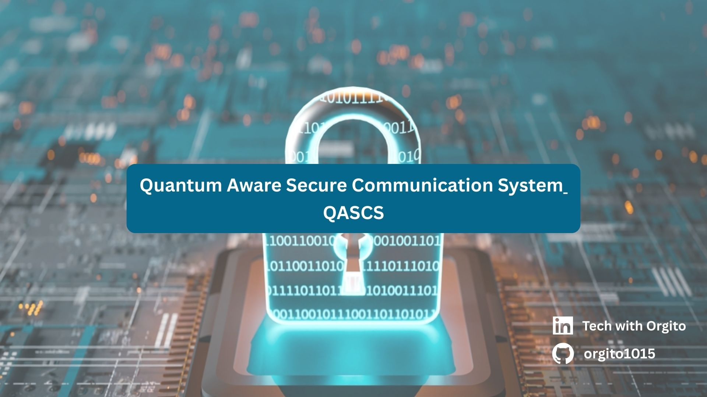

# QASCS — Quantum‑Aware Secure Communication System

A **single, focused project** that combines:

- **Quantum**: explicit threat model (Shor/Grover), and a **Quantum Risk Engine** that decides whether a crypto setup is *quantum‑safe for a data lifetime*.
- **Cybersecurity**: a working **secure client ↔ server** channel (TLS) with **crypto‑agility** (policy decides classical vs PQC/hybrid) — and, since the PQC enforcement layer itself isn't implemented yet, a policy that *refuses to silently downgrade* rather than pretending it did something it didn't.

This repo is designed to be:
- **Runnable today** in *Classical TLS* mode (pure Python).
- **Extendable** to **Post‑Quantum / Hybrid TLS** using OQS‑OpenSSL (documented integration path).

---

## Quick start (Classical TLS demo)

### 1) Create a venv + install package
```bash
python -m venv .venv
source .venv/bin/activate  # Windows: .venv\Scripts\activate
pip install -e .  # Installs the qasccs package + a `qasccs` command on PATH
```

Or use the Makefile shortcut:
```bash
make install  # Installs package with dev dependencies (pytest, ruff, mypy)
```

### 2) Generate a self‑signed cert (dev only)
```bash
qasccs gen-certs --out qasccs/secure_channel/certs
```
Re-running this is safe — it's idempotent by default and won't mint a new CA
if certs already exist in `--out` (pass `--force` to regenerate).

### 3) Run server (Terminal A)
```bash
qasccs server --host 127.0.0.1 --port 8443
```

### 4) Run client (Terminal B)
```bash
qasccs client --host 127.0.0.1 --port 8443 --data-lifetime-years 10 --data-classification medium
```

You will see:
- the client asks the **Quantum Risk Engine** for a policy decision
- the channel is established using **mutual TLS** (mTLS) — the server verifies the client's certificate and vice versa
- messages are exchanged securely using a length-prefixed framing protocol, carrying a small versioned message envelope (see `qasccs/secure_channel/protocol.py`)

> Every subcommand above still also works as `python -m qasccs.secure_channel.server` /
> `python -m qasccs.secure_channel.client` / `python -m qasccs.tools.gen_certs`, unchanged.
> `qasccs <subcommand>` is just the single, discoverable entry point (`qasccs --help`
> lists everything).

### Try the strict PQC-policy enforcement

Real PQC/hybrid TLS isn't implemented yet (see "Post-Quantum / Hybrid TLS"
below) — so the client refuses, by default, to silently proceed with
classical-only TLS when the Quantum Risk Engine recommends `pqc`/`hybrid`:

```bash
qasccs client --data-lifetime-years 10 --data-classification high
# -> ERROR: Policy recommends 'hybrid' but only classical TLS is implemented...
# -> exit code 2
```

Opt in explicitly if you want the old demo-only behavior (proceed with
classical TLS + a warning):

```bash
qasccs client --data-lifetime-years 10 --data-classification high --allow-classical-fallback
```

See `docs/pqc-integration.md` for the full `--strict-policy` /
`--allow-classical-fallback` / `--no-strict-policy` reference.

---

## Run with Docker
```bash
docker compose build
docker compose up gen-certs   # generates a throwaway dev CA + server/client certs into a shared volume
docker compose up -d server   # starts the mTLS server on :8443
docker compose --profile demo run --rm client   # one-shot client against it
```
The compose client demo passes `--allow-classical-fallback` explicitly (its
`high` classification recommends `hybrid`, which isn't implemented yet) so
the demo completes end-to-end — see the comment in `docker-compose.yml`.

See `Dockerfile` / `docker-compose.yml` for details, and "Production considerations" below before deploying this anywhere real.

---

## Quantum part (what's actually "quantum" here?)

- `qasccs/quantum_risk_engine/` models a quantum adversary:
  - **Shor** breaks RSA/ECC (public‑key)
  - **Grover** reduces symmetric security (e.g., AES‑256 → ~128)
- It outputs a **machine‑readable decision**:
  - `risk: LOW/MEDIUM/HIGH`
  - `recommended_mode: classical | pqc | hybrid`
  - `quantum_safe_until_year`
- The scenario-year assumptions behind that decision (when a
  cryptographically-relevant quantum computer is assumed to exist) are
  tunable without editing source: `--policy-config path/to/policy.yaml` or
  `QASCS_POLICY_CONFIG`, on both `qasccs risk` and `qasccs client`. See
  `qasccs/quantum_risk_engine/default_policy.yaml` for the format.

See: `docs/threat-model.md` (now with FIPS 203/204/205 references for the
ML-KEM/ML-DSA/SLH-DSA standardized names behind the informal
Kyber/Dilithium/SPHINCS+ literals used here).

---

## Post‑Quantum / Hybrid TLS (optional extension)

Pure Python cannot do PQC TLS alone. This repo includes a clean path:
- use **OQS‑OpenSSL** (OpenSSL + oqsprovider) and run `openssl s_server`/`s_client`
- keep the **same Quantum Risk Engine policy** to decide when to require PQC/hybrid

This isn't implemented yet — see "Real PQC/hybrid enforcement" under
Production considerations, and `docs/pqc-integration.md` for the full
integration path and the current `--strict-policy` stopgap.

---

## Optional: web dashboard for the Quantum Risk Engine

A small FastAPI app exposing the same `evaluate_risk()` decision over HTTP,
with a minimal accessible HTML form — this is the one part of the project
where things like responsive layout and accessible form markup genuinely
apply (the rest of QASCS is a CLI/library, not a web app).

```bash
pip install -e ".[web]"
qasccs web --host 127.0.0.1 --port 8000
# open http://127.0.0.1:8000
```

`POST /api/risk` reuses the `RiskRequest`/`RiskResponse` Pydantic models
directly, so `/docs` gets a free OpenAPI/Swagger UI.

## Optional: Prometheus metrics for the secure channel

Off by default (never opens an extra port unless configured):

```bash
pip install -e ".[observability]"
QASCS_METRICS_PORT=9100 qasccs server
# scrape http://127.0.0.1:9100/metrics
```

Emits connection counts, handshake failures, active connections, and
message-size histograms. See `qasccs/secure_channel/metrics.py` and
`docs/scaling.md` for aggregating these across multiple replicas.

---

## Run tests
```bash
# Install package with dev dependencies first (includes pytest, ruff, mypy)
pip install -e ".[dev]"
# or: make install

# Run tests
pytest -q

# Lint + type-check (what CI runs)
ruff check .
mypy qasccs
```

---

##  Project Management

This repository uses **GitHub Projects** for project management and issue tracking. 

### For Contributors
- Check the [Project Board](https://github.com/orgito1015/Quantum-Aware-Secure-Communication-System-QASCS-/projects) to see current priorities
- Read the [Contributing Guide](.github/CONTRIBUTING.md) before submitting PRs
- Use [Issue Templates](.github/ISSUE_TEMPLATE/) when reporting bugs or requesting features
- Review the [Project Roadmap](.github/ROADMAP.md) to see planned features
- See [CHANGELOG.md](CHANGELOG.md) for what changed between releases, and
  [SECURITY.md](SECURITY.md) to report a vulnerability privately

### Getting Started with GitHub Projects
- See [Project Setup Guide](.github/PROJECT_SETUP.md) for detailed instructions on creating and managing the project board
- Review [Sample Issues](.github/SAMPLE_ISSUES.md) for examples of well-structured issues

---

## Production considerations

This repo ships as a runnable **reference/demo**. Several pieces of hardening are
now in place, but a few decisions can only be made by whoever operates a real
deployment — they are called out explicitly below rather than silently assumed.

### Already handled by the code
- **Mutual TLS (mTLS)**: the server requires and verifies a client certificate;
  the client verifies the server's. TLS 1.2 is the enforced floor.
- **Versioned message envelope over length-prefixed framing**
  (`secure_channel/protocol.py` on top of `send_msg`/`recv_msg` in
  `common.py`), so the wire protocol doesn't assume a whole message arrives
  in one `recv()`, and isn't just a hardcoded echo string.
- **PQC policy is enforced, not just logged.** `--strict-policy` (on by
  default) makes the client refuse (exit 2) to silently fall back to
  classical TLS when the Quantum Risk Engine recommends `pqc`/`hybrid`.
- **Bounded concurrency**: the server uses a fixed-size thread pool
  (`QASCS_MAX_CONNECTIONS`, default 100) instead of one unbounded thread per
  connection, and a per-connection timeout (`QASCS_CONN_TIMEOUT`, default 30s)
  so a stalled or slow-loris peer can't tie up a worker indefinitely.
- **Graceful shutdown**: `SIGTERM`/`SIGINT` drain in-flight connections before
  exiting — important for container orchestrators that send `SIGTERM` on
  scale-down/redeploy. Covered by real tests that exercise the accept loop,
  not just the TLS context builders.
- **Structured logging** (`qasccs/logging_config.py`) to stderr, level
  controlled by `QASCS_LOG_LEVEL`, instead of unstructured `print()`.
- **Clear configuration errors**: a missing/misconfigured cert fails fast with
  an operator-actionable message (`CertificateConfigError`), not a raw
  traceback or a silent SSL failure.
- **Private key file permissions**: `gen_certs.py` writes all `.key` files
  `chmod 0600`, and is idempotent by default (won't mint a fresh CA on every
  re-run — important for `docker compose`, whose one-shot `gen-certs`
  dependency service can be re-triggered on every `up`/`run`).
- **CI**: the test matrix covers the Python versions the package actually
  declares support for (`3.10`-`3.13`, matching the Dockerfile's `3.12`);
  `ruff` (with `pyupgrade` rules enabled — this is exactly the check that
  would have caught this project's original Python-3.11-only `datetime.UTC`
  bug automatically instead of at runtime) and `mypy` both run on every PR;
  a Docker build + smoke test runs in CI.
- **Optional observability**: Prometheus metrics (opt-in, `QASCS_METRICS_PORT`)
  for connection counts, handshake failures, and message sizes.

### You still need to decide/provision before going to production
- **Real PKI, not the bundled dev CA.** `qasccs/tools/gen_certs.py` issues a
  throwaway self-signed CA for local testing only. In production, issue
  server/client certs from your organization's CA (or a managed one — e.g.
  AWS Private CA, HashiCorp Vault PKI, cert-manager on Kubernetes) and point
  `QASCS_CERT_DIR` (or the individual `QASCS_SERVER_CERT` /
  `QASCS_SERVER_KEY` / `QASCS_CLIENT_CERT` / `QASCS_CLIENT_KEY` /
  `QASCS_CA_CERT` env vars) at that material. Never ship private keys inside
  a container image — mount them at runtime (see `docker-compose.yml`).
- **Certificate rotation and revocation.** Nothing here handles CRL/OCSP
  checking or automatic rotation; that's the job of whatever PKI system you
  adopt.
- **Secrets management.** If certs/keys are pulled from a secrets manager
  (Vault, AWS Secrets Manager, etc.) rather than a mounted file, that
  integration is on you — `common.py`'s env vars just need to resolve to
  readable file paths.
- **TLS identity vs. connection target.** If clients connect via a load
  balancer, Kubernetes Service name, or container hostname that differs from
  what's in the certificate's SAN, use `--tls-server-name` /
  `QASCS_TLS_SERVER_NAME` on the client to verify against the right name
  (see `docker-compose.yml` for a worked example).
- **Real PQC/hybrid enforcement.** The Quantum Risk Engine's
  `recommended_mode: pqc | hybrid` is enforced as a hard stop by default
  (`--strict-policy`) rather than silently downgraded, but the actual
  OQS-OpenSSL/liboqs PQC channel itself still isn't implemented — wiring it
  is described in `docs/pqc-integration.md`.
- **High availability.** This is a single process per replica. See
  `docs/scaling.md` for the recommended stateless-replicas-behind-an-L4-LB
  architecture and exactly what does/doesn't scale automatically
  (`QASCS_MAX_CONNECTIONS` is per-replica only).
- **Resource limits at the platform level.** `QASCS_MAX_CONNECTIONS` bounds
  application-level concurrency, but CPU/memory limits, autoscaling, and
  DDoS/L4 protection belong to your container platform or cloud provider, not
  this codebase.
- **Dependency & base-image patching.** Pin and regularly update
  `cryptography`/`pydantic`/the `python:3.12-slim` base image for CVE
  patches. `.github/dependabot.yml` now handles this repo's own pip/Docker/
  GitHub Actions dependencies; a real deployment consuming `qasccs` as a
  dependency still needs its own dependency-bot tooling.

---

## Disclaimer
This project is for **learning/research**. The default certificate generation is **dev‑only** and not production‑ready — see "Production considerations" above for what to replace before deploying it anywhere real.
