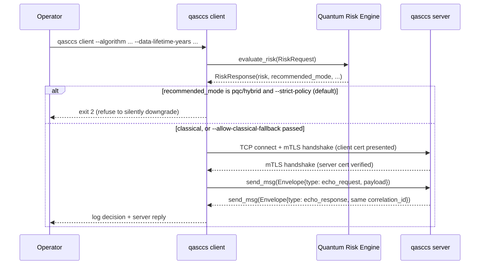
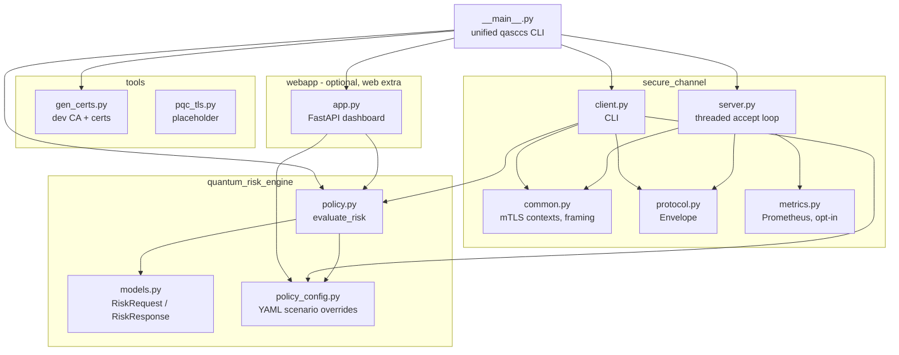

# Architecture (QASCS)

## High-level flow
1. Client wants confidentiality for `N` years.
2. Client requests a **policy decision** from the Quantum Risk Engine.
3. Policy returns `recommended_mode` + risk details.
4. Client enforces the decision:
   - today: Python TLS (`classical`)
   - `pqc`/`hybrid` recommended but unimplemented: refuse by default
     (`--strict-policy`, see `docs/pqc-integration.md`) unless the operator
     explicitly opts into a classical fallback.
   - extension: OQS-OpenSSL (`pqc` / `hybrid`) — not implemented yet.
5. Secure channel established (mutual TLS) → versioned message envelopes
   exchanged over the length-prefixed wire framing.

## Sequence diagram

## Component diagram

